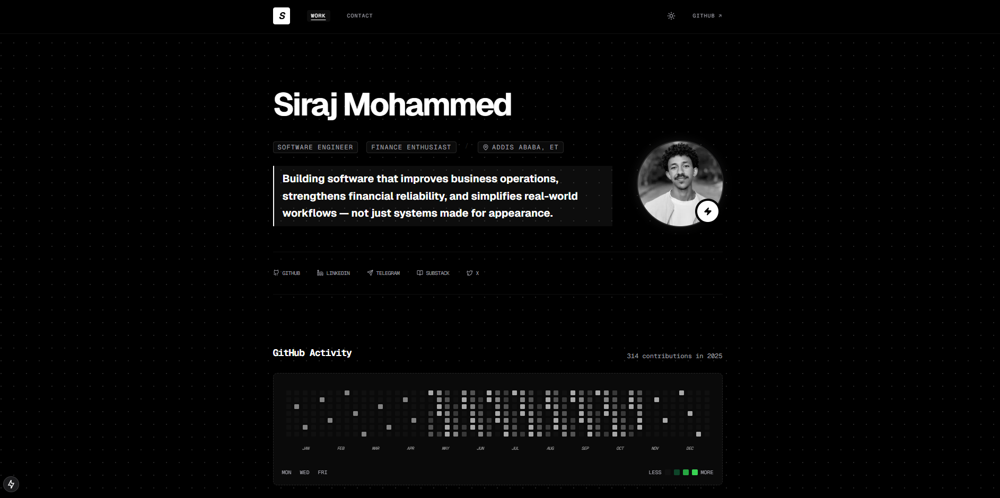

# Professional Portfolio

<div align="center">
  
</div>

## Overview

Welcome to my professional portfolio. This project showcases my work as a Software Engineer, focusing on business operations, financial workflows, and high-integrity systems.

## Key Projects

- **Wizdom Pass**: Full-stack educational platform features.
- **TebibX**: AI-powered developer tool for codebase activity tracking.
- **Document Processing Gateway**: Academic administration system for Wollo University.
- **KYC (Know Your Customer)**: Secure identity verification platform.
- **Store Inventory App**: IFRS-aligned inventory management system.
- **Hospital Management System**: Comprehensive clinical enterprise solution.

## Tech Stack

- **Frontend**: Next.js, React, TypeScript, Tailwind CSS
- **Backend**: Node.js, FastAPI, Django, .NET, C#
- **Database**: MS SQL Server, PostgreSQL, Supabase
- **Tools**: Docker, Nginx, Git, GitHub Actions

## Getting Started

### Prerequisites

- Node.js (Latest LTS recommended)
- npm or yarn

### Installation

1. Clone the repository:
   ```bash
   git clone https://github.com/jaris02/porfolio.git
   ```

2. Install dependencies:
   ```bash
   npm install
   ```

3. Run the development server:
   ```bash
   npm run dev
   ```

4. Open [http://localhost:3000](http://localhost:3000) in your browser.

## Contact

- **Email**: [zizuasmat@gmail.com](mailto:zizuasmat@gmail.com)
- **LinkedIn**: [Siraj Mohammed](https://www.linkedin.com/in/jaris02)
- **GitHub**: [@jaris02](https://github.com/jaris02)